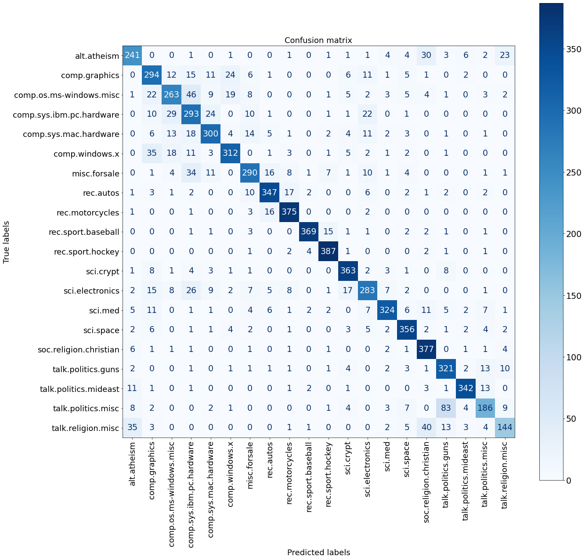
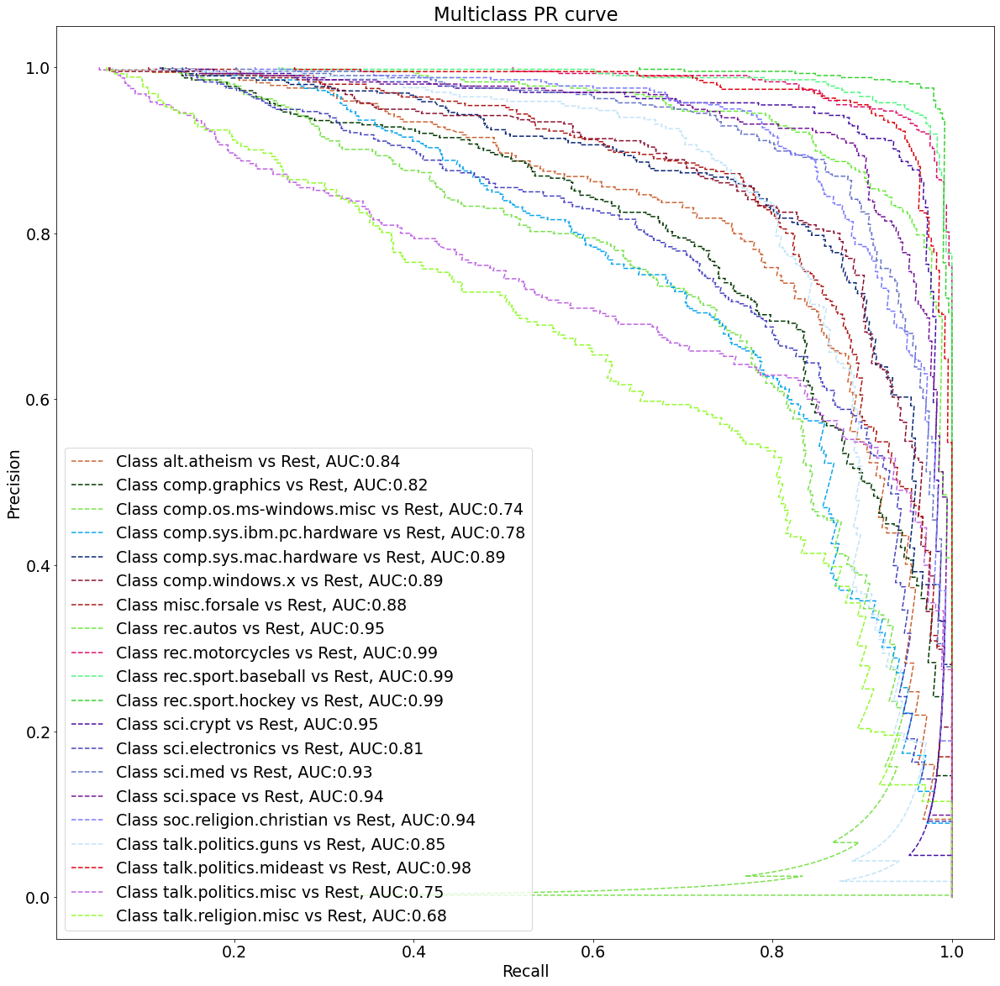

### Develop and deploy an inference pipeline in AWS Sagemaker
This tutorial has the below objectives :
1. Train a machine learning model with a newsgroup [dataset](https://scikit-learn.org/0.19/datasets/twenty_newsgroups.html) which should be able to categorize
   a news summary from 20 different news categories ([link to python notebook](https://github.com/prabhupad26/aws-sm-inference-pipline-tutorial/blob/master/analysis/news_group_classification.ipynb)).
   
2. Create an inference pipeline in AWS Sagemaker and deploy it on sklearn [docker container](https://docs.aws.amazon.com/sagemaker/latest/dg/pre-built-docker-containers-scikit-learn-spark.html), ([source code folder](https://github.com/prabhupad26/aws-sm-inference-pipline-tutorial/tree/master/newsgroup_classifier)).


#### Building the model

> Prerequisites: 
>  1. Create a python venv, conda env with jupyter notebook. 
>  2. `pip install -r requirements.txt` (Run the requirements.txt file present [here](https://github.com/prabhupad26/aws-sm-inference-pipline-tutorial/tree/master/analysis/requirements.txt))

* We will load the dataset using the sklearn `fetch_20newsgroups` function


```python
newsgroups_train = fetch_20newsgroups(subset='train')
newsgroups_test = fetch_20newsgroups(subset='test')
```


```python
# There are about 11k train data and 7.5k test data (emails containing the new summary).
print(f" Train data contains {len([newsgroups_train.target_names[index] for index in newsgroups_train.target])} data points")
print(f" Test data contains {len([newsgroups_train.target_names[index] for index in newsgroups_test.target])} data points")
```

     Train data contains 11314 data points
     Test data contains 7532 data points
    

* View one sample data


```python
# Data
print(newsgroups_train['data'][0])
```

    From: lerxst@wam.umd.edu (where's my thing)
    Subject: WHAT car is this!?
    Nntp-Posting-Host: rac3.wam.umd.edu
    Organization: University of Maryland, College Park
    Lines: 15
    
     I was wondering if anyone out there could enlighten me on this car I saw
    the other day. It was a 2-door sports car, looked to be from the late 60s/
    early 70s. It was called a Bricklin. The doors were really small. In addition,
    the front bumper was separate from the rest of the body. This is 
    all I know. If anyone can tellme a model name, engine specs, years
    of production, where this car is made, history, or whatever info you
    have on this funky looking car, please e-mail.
    
    Thanks,
    - IL
       ---- brought to you by your neighborhood Lerxst ----
    
    
    
    
    
    

* Now we will create data frames and do some preprocessing like removing whitespaces, removing header from each datapoint


```python
train_df = pd.DataFrame({'data':['\n'.join(list(filter(lambda x: x != '', data.split('\n')[5:]))) 
                                 for data in newsgroups_train['data']],
                         'data_subject':['\n'.join(list(filter(lambda x: 'subject' in x.lower(), data.split('\n'))))[9:]
                                         for data in newsgroups_train['data']],
                         'label_names':[newsgroups_train.target_names[index] for index in newsgroups_train.target],
                         'label':newsgroups_train.target})
test_df = pd.DataFrame({'data':['\n'.join(list(filter(lambda x: x != '', data.split('\n')[5:]))) 
                                 for data in newsgroups_test['data']],
                         'data_subject':['\n'.join(list(filter(lambda x: 'subject' in x.lower(), data.split('\n'))))[9:]
                                         for data in newsgroups_test['data']],
                         'label_names':[newsgroups_test.target_names[index] for index in newsgroups_test.target],
                         'label':newsgroups_test.target})
```


```python
train_df.head()
```


<div>
<table border="1" class="dataframe">
  <thead>
    <tr style="text-align: right;">
      <th></th>
      <th>data</th>
      <th>data_subject</th>
      <th>label_names</th>
      <th>label</th>
    </tr>
  </thead>
  <tbody>
    <tr>
      <th>0</th>
      <td>I was wondering if anyone out there could enl...</td>
      <td>WHAT car is this!?</td>
      <td>rec.autos</td>
      <td>7</td>
    </tr>
    <tr>
      <th>1</th>
      <td>Organization: University of Washington\nLines:...</td>
      <td>SI Clock Poll - Final Call</td>
      <td>comp.sys.mac.hardware</td>
      <td>4</td>
    </tr>
    <tr>
      <th>2</th>
      <td>well folks, my mac plus finally gave up the gh...</td>
      <td>PB questions...\nthis is a real subjective que...</td>
      <td>comp.sys.mac.hardware</td>
      <td>4</td>
    </tr>
    <tr>
      <th>3</th>
      <td>NNTP-Posting-Host: amber.ssd.csd.harris.com\nX...</td>
      <td>Re: Weitek P9000 ?</td>
      <td>comp.graphics</td>
      <td>1</td>
    </tr>
    <tr>
      <th>4</th>
      <td>From article &lt;C5owCB.n3p@world.std.com&gt;, by to...</td>
      <td>Re: Shuttle Launch Question</td>
      <td>sci.space</td>
      <td>14</td>
    </tr>
  </tbody>
</table>
</div>


* Till now we have just prepared the data to be suitable for futher preprocessing steps, now we will will use it to remove the email id, stopwords, create tokens(divide the entire news summary into tokens(words)) .
> In order add more words to stopwords list in nltk use `stopwords_list.extend(['wordA', 'wordB'])` .


```python
stopwords_list = stopwords.words('english')
def remove_stopwords(sent):
    final_sent = ''
    for word in sent.split(' '):
        if word not in stopwords_list:
            final_sent += word
            final_sent += ' '
    final_sent = re.sub(r'[\w\.-]+@[\w\.-]+', ' ',  final_sent) # remove all email addresses from each datapoint
    return final_sent    
```


```python
train_df['data'] = train_df.data.apply(lambda x: x.strip().lower()) # removed whitespace and lowercase
train_df['data'] = train_df.data.apply(lambda x: re.sub(r'[^a-zA-Z]', ' ', x)) # removed special chars
train_df['data'] = train_df.data.apply(remove_stopwords) # removed stopwords
train_df['data_tokens'] = train_df.data.apply(tokenize.word_tokenize)


test_df['data'] = test_df.data.apply(lambda x: x.strip().lower()) # removed whitespace and lowercase
test_df['data'] = test_df.data.apply(lambda x: re.sub(r'[^a-zA-Z]', ' ', x)) # removed special chars
test_df['data'] = test_df.data.apply(remove_stopwords) # removed stopwords
test_df['data_tokens'] = test_df.data.apply(tokenize.word_tokenize)
```

> Saving the data for AWS Sagemaker, the generated files will be uploaded to s3 storage using this [script](https://github.com/prabhupad26/aws-sm-inference-pipline-tutorial/blob/master/newsgroup_classifier/upload_train_data_s3.py)


```python
train_df.to_csv('../newsgroup_classifier/data/train.csv')
test_df.to_csv('../newsgroup_classifier/data/test.csv')
```

* We will now try to visualize the data to get some insights


```python
# Downloading punkt for tokenization , execute this cell only for  1st run only
nltk.download('punkt')
```


```python
tokenize_train_data = []
for data in train_df.data.values:
    tokenize_train_data += tokenize.word_tokenize(data)
print(len(tokenize_train_data))
```

    1897170
    


```python
freq_words = defaultdict(int)
for data in tokenize_train_data:
    freq_words[data]+=1

f_dist = dict(freq_words)
f_dist_dict = dict([(m, n) for m, n in f_dist.items() if n > 3 and len(m) > 2 and n < 100])
f_dist_dict = sorted(f_dist_dict.items(), key= lambda kv: kv[1], reverse=True)
print("Top 10 most frequent words")
print(f_dist_dict[:10])
print("--------------------------")
print("Top 10 least frequent words")
print(f_dist_dict[-10:])
```

    Top 10 most frequent words
    [('corner', 99), ('constant', 99), ('wonderful', 99), ('observations', 99), ('survey', 99), ('roman', 99), ('oracle', 99), ('ama', 99), ('screw', 99), ('diego', 99)]
    --------------------------
    Top 10 least frequent words
    [('stds', 4), ('positivity', 4), ('prevalences', 4), ('lilac', 4), ('calloway', 4), ('snijpunten', 4), ('jackman', 4), ('melpar', 4), ('chineham', 4), ('critz', 4)]
    

* Create a wordcloud to see some visualization of word frequency


```python
wrd = []
for kv in f_dist_dict:
    wrd += ((kv[0]+' ')*kv[1]).split()
len(wrd)
```


    461680


```python
words_cloud_str = ' '.join(wrd)
wordcloud_newsgrp = WordCloud(background_color="white", max_font_size=5000, max_words=30000).generate(words_cloud_str)

plt.figure(figsize = (50,50))
plt.imshow(wordcloud_newsgrp, interpolation='bilinear')
plt.axis("off")
plt.show()
```


    

    


* Create word vectors: TD-IDF word vectors

> Checking how tf-idf matrix is created with sci-kit learn


```python
len(tokenize_train_data)
```


    1897170


```python
vct = TfidfVectorizer()
sample_text = ['this is sent1 and this is sent3 ', 'let\'s see how tf idf will perform', 'let\'s see how tf idf will perform' ]
vctrs = vct.fit_transform(sample_text)
vctrs
```


    <3x12 sparse matrix of type '<class 'numpy.float64'>'
    	with 19 stored elements in Compressed Sparse Row format>


```python
sample_text = ['this is sent1 and this is sent3', 'let\'s see how tf idf will perform', 'let\'s see how tf idf will perform' ]
a = []
for i in sample_text:
    a += i.split()
len(set(a))
```


    12


```python
print(f"Total number of non-zero elements per sentence (per row in sparse matrix) are : \033[35m{vctrs.nnz / float(vctrs.shape[0])}")
```

    Total number of non-zero elements per sentence (per row in sparse matrix) are : 6.333333333333333
    

> Working on train data


```python
vectorizer = TfidfVectorizer()
vectors = vectorizer.fit_transform(train_df.data.values)
vectors
```


    <11314x85964 sparse matrix of type '<class 'numpy.float64'>'
    	with 1149626 stored elements in Compressed Sparse Row format>


```python
print(f"Total number of non-zero elements per sentence (per row in sparse matrix) are : \033[35m{vectors.nnz / float(vectors.shape[0])}")
```

    Total number of non-zero elements per sentence (per row in sparse matrix) are : 101.61092451829592
    


```python
import sys
print(f"Memory size occupied by the matrix : \033[35m{sys.getsizeof(vectors)} bytes")
```

    Memory size occupied by the matrix : 48 bytes
    


```python
vectors_test = vectorizer.transform(test_df.data)
clf = MultinomialNB(alpha=.01)
clf.fit(vectors, train_df.label.values)
pred = clf.predict(vectors_test)
pred
```


    array([ 7, 11,  0, ...,  9, 12, 15])


* Evaluating the model


```python
metrics.f1_score(test_df.label.values, pred, average='macro')
```


    0.8118865539222201


```python
metrics.accuracy_score(y_pred=pred, y_true=test_df.label.values)
```


    0.8187732342007435


```python
fig, ax = plt.subplots(figsize = (20,20))
disp = metrics.plot_confusion_matrix(clf, vectors_test, test_df.label.values,
                                 cmap=plt.cm.Blues,
                                 display_labels=[train_df.label_names[train_df.label == result_label].values[0]
                                                 for result_label in range(20)],
                                 normalize=None, ax=ax)
disp.ax_.set_title("Confusion matrix", fontsize=18)
plt.rcParams.update({'font.size': 19})
plt.xticks(rotation=90, fontsize=18)
plt.yticks(fontsize=18)
plt.xlabel("Predicted labels", fontsize=18)
plt.ylabel("True labels", fontsize=18)
plt.show()
```


    

    


#### Since this is a multiclass classification so the one vs all ( whether the output is a specific class or not) approach is taken while plotting the confusion matrix, for example there are 241 instances where alt.atheism category is correctly classifies as alt.atheism (True Positive) while the same class is 23 times misinterpreted as talk.religion.misc (False Negative) and talk.religion.misc is 35 times mis classified as alt.atheism (False Positive)


```python
clf_1vrest = OneVsRestClassifier(MultinomialNB(alpha=.01))
clf_1vrest.fit(vectors, train_df.label.values)
pred_prob = clf_1vrest.predict_proba(vectors_test)
fpr = {}
tpr = {}
thresh ={}

n_class = 20

for i in range(n_class):    
    fpr[i], tpr[i], thresh[i] = roc_curve(test_df.label.values, pred_prob[:,i], pos_label=i)
    
# plotting 
plt.figure(figsize=(20, 20))
for i in range(n_class): 
    r=random.random()
    g=random.random()
    b=random.random()
    plt.plot(fpr[i], tpr[i], linestyle='--',c=(r, g, b),
             label=f'Class {train_df.label_names[train_df.label == i].values[0]} vs Rest, AUC : {metrics.auc(fpr[i], tpr[i]):0.2f}')
plt.title('Multiclass ROC curve')
plt.xlabel('False Positive Rate')
plt.ylabel('True Positive rate')
plt.legend(loc='best')
plt.savefig('Multiclass ROC.png',dpi=300)
```


    

    


* The True positive rate (Recall) VS False positive rate (1- specificity) also known as the ROC curve suggests that the model has classified almost every category correctly. 


```python
clf_1vrest = OneVsRestClassifier(MultinomialNB(alpha=.01))
clf_1vrest.fit(vectors, train_df.label.values)
pred_prob = clf_1vrest.predict_proba(vectors_test)
pr = {}
recall = {}
thresh ={}

n_class = 20

for i in range(n_class):    
    pr[i], recall[i], thresh[i] = metrics.precision_recall_curve(test_df.label.values, pred_prob[:,i], pos_label=i)
    
# plotting 
plt.figure(figsize=(20, 20))
for i in range(n_class): 
    r=random.random()
    g=random.random()
    b=random.random()
    plt.plot(pr[i], recall[i], linestyle='--',c=(r, g, b), 
             label=f'Class {train_df.label_names[train_df.label == i].values[0]} vs Rest, AUC:{metrics.auc(recall[i], pr[i]):0.2f}')
plt.title('Multiclass PR curve')
plt.xlabel('Recall')
plt.ylabel('Precision')
plt.legend(loc='best')
plt.savefig('Multiclass PRCurve.png',dpi=300)
```


    

    


* From the PR curve it looks there are chances of class imbalance for those categories which has lower Area Under the Curve, so the model could be a bit biased towards the other categories which has greater AUC. This could be avoided by including more data for those categories with less AUC.
